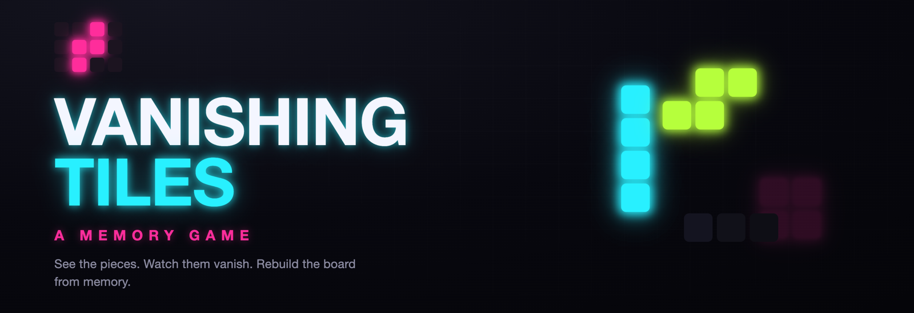
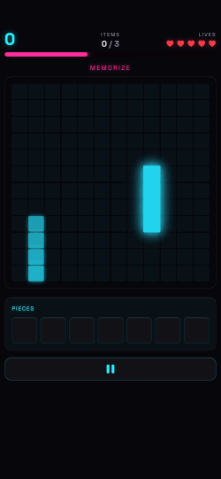
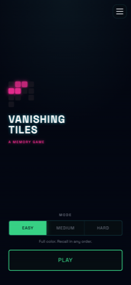
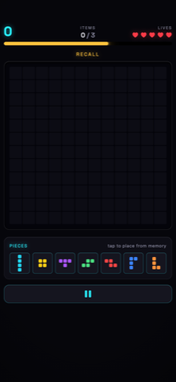
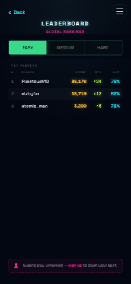

<div align="center">



<h1>Vanishing Tiles™</h1>

**A memory game that tests how well you can recall what you just saw.**

Pieces appear on the board, then vanish. Rebuild them from memory — faster and
deeper every round.

[](https://vanishingtiles.weekendpro.io)

[](https://react.dev)
[](https://www.typescriptlang.org)
[](https://vite.dev)
[](https://tailwindcss.com)
[](https://supabase.com)


</div>

---

## The idea

Most puzzle games test what you can *figure out*. Vanishing Tiles tests what you
can *remember*.

A handful of tile pieces bloom onto a dark board, one at a time — then they're
gone. Now the board is empty and a tray of pieces sits in front of you. Your job
is to recall exactly what you saw and tap the pieces back, before the clock runs
out. Get it right and the next round shows you a little more. Miss, and you lose
a life. It's a single, endlessly escalating test of visual memory, wrapped in a
neon arcade skin.

<div align="center">



</div>

## How it plays

The whole game is one tight loop that repeats, getting harder each time:

| 1 · Memorize | 2 · Vanish | 3 · Recall |
| :---: | :---: | :---: |
| Pieces flash onto the void board, one by one, each glowing then fading. | The board goes dark. Everything you saw is gone. | Rebuild it from the piece tray before the select clock empties. |

Clear a round and the next one starts immediately — a little bigger, a little
faster, a little less forgiving. Your **streak** is the score multiplier
(`100 × streak` per correct recall) plus a speed bonus for clearing quickly.
You start with **5 lives** and earn one back every 5,000 points; the run ends at
zero. There are no levels and no finish line — just how far your memory can take you.

## Modes

Pick your challenge on the home screen. Every mode is the same core loop, tuned
for a different kind of memory:

| Mode | Reveal | Recall |
| :--- | :--- | :--- |
| 🟢 **Easy** | Full color | In any order |
| 🟡 **Medium** | Monochrome neon | In any order |
| 🔴 **Hard** | Monochrome neon | **In the exact order shown** |

> **Training** — a separate, consequence-free drill for learning the seven piece
> shapes by name. No clock, no lives, no score: just a piece, a row of letters,
> and your reaction time.

## Screens

<div align="center">
<table>
  <tr>
    <td align="center"><br /><sub><b>Home</b> — pick a mode, press play</sub></td>
    <td align="center"><br /><sub><b>Recall</b> — tap the pieces from memory</sub></td>
    <td align="center"><br /><sub><b>Leaderboard</b> — global per-mode rankings</sub></td>
  </tr>
</table>
</div>

## The look — *Afterglow*

The visual language is called **Afterglow**: a phosphor-inspired system built
around a near-black "void" board and three neon accents — cyan, magenta, and
lime. Pieces don't just appear and disappear; they **bloom** in with a bright
flash and **decay** out with a per-cell ghost trail, like light fading on an old
CRT. That afterimage *is* the game — the fading trail is exactly what you have to
hold in your head. Every countdown, miss shake, and score pop is tuned to feel
like a piece of arcade hardware, and the entire sound palette is pure Web Audio
synthesis (no audio files).

## Tech

A modern, all-TypeScript web stack — architected so the game engine can be shared
between the browser and the backend, and eventually ported to mobile.

- **Frontend** — React 18 + TypeScript, [Vite](https://vite.dev) build, [Tailwind CSS](https://tailwindcss.com), [Framer Motion](https://www.framer.com/motion/) for the Afterglow animation, [Zustand](https://github.com/pmndrs/zustand) for state.
- **Backend** — [Supabase](https://supabase.com): Postgres (with migrations) for accounts and leaderboards, Auth (email, Google, guest), and Edge Functions.
- **Shared game engine** — the puzzle generator, backtracking solver, piece
  definitions, and types live in `supabase/functions/_shared` and are imported by
  **both** the client and the Edge Functions via the `@shared` alias — one source
  of truth, no duplicated logic across the network boundary.
- **Sound** — a semantic, fully-synthesized Web Audio palette (`src/lib/sfx.ts`),
  portable to `react-native-audio-api` for the mobile port.
- **Quality** — [Vitest](https://vitest.dev) (34 test suites) + ESLint + strict
  TypeScript. Deployed on [Vercel](https://vercel.com).

<details>
<summary><b>Project structure</b></summary>

```
src/
  App.tsx                 Auth-gated router (auth → home → game screens)
  components/
    HomeScreen.tsx        Mode switch + Play
    StaggerScreen.tsx     The main game: reveal board, tray, HUD, game-over
    TrainingScreen.tsx    The piece-naming drill
    LeaderboardScreen.tsx Global per-mode rankings
    ...
  store/                  Zustand stores (staggerStore, trainingStore, profile, settings, …)
  lib/
    staggerCurve.ts       The single infinite difficulty/scoring ramp
    sfx.ts                Synthesized Web Audio sound palette

supabase/
  functions/_shared/      Engine shared by client + edge (aliased @shared)
    engine/               pieces · puzzleGenerator · solver
    types.ts              PieceType, Grid, etc.
  migrations/             Postgres schema (profiles, leaderboards, RPCs)

docs/                     Design specs, plans, and this playbook
```

</details>

## Run it locally

```bash
npm install
npm run dev          # → http://localhost:5173
```

Other useful scripts:

```bash
npm run test         # Vitest suite (must pass before commit)
npm run build        # type-check + production build
npm run lint         # ESLint
npm run db:start     # local Supabase (requires Docker + Supabase CLI)
```

> The app expects Supabase credentials in `.env.local` for auth and leaderboards.
> Without them the UI still runs; account-backed features are inert.

## Roadmap

- [x] **Web POC** — complete and playable at [vanishingtiles.weekendpro.io](https://vanishingtiles.weekendpro.io)
- [ ] **React Native port** — the shared engine + portable sound layer are built for this
- [ ] **Apple App Store** release

## License

**Proprietary — all rights reserved.** This repository is public for portfolio
and reference purposes only; it is **not** open source and no reuse rights are
granted. See [`LICENSE`](LICENSE). *Vanishing Tiles™* and *Weekend Pro™* are
trademarks of the copyright holder.

<div align="center">
<sub>Made by <b>Weekend Pro</b> 🌆</sub>
</div>
